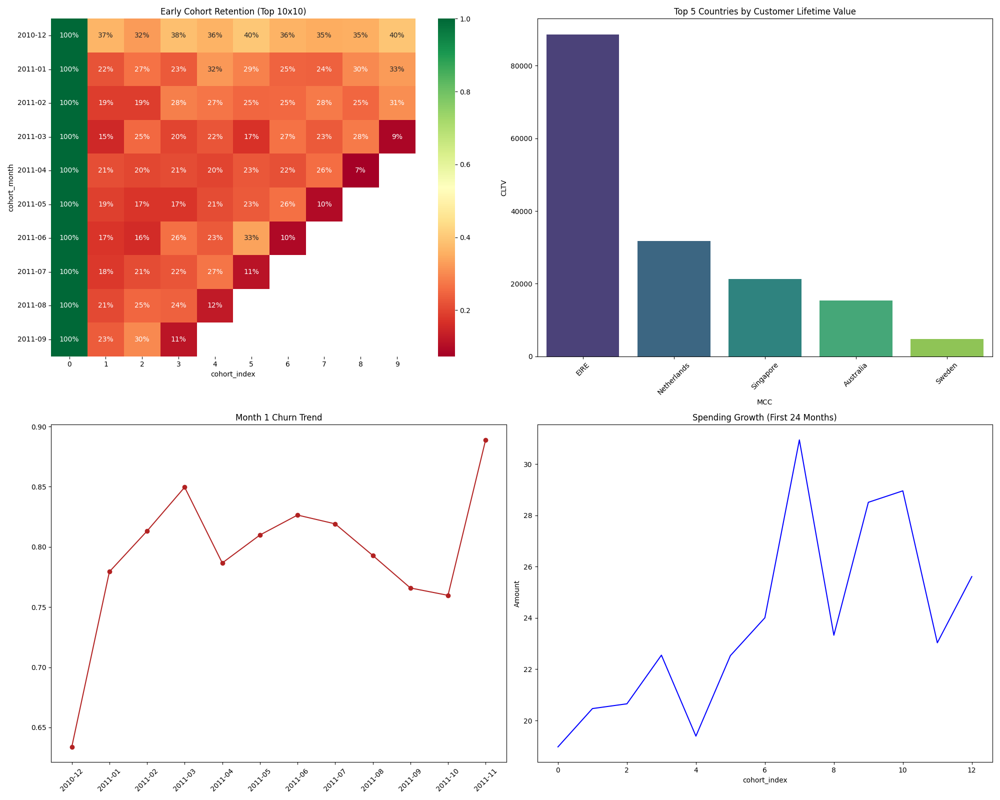

# E-commerce User Retention & Cohort Analysis

A data science project analyzing user retention, churn, and customer lifetime value (CLTV) for an e-commerce platform using real transaction data. Includes cohort analysis, churn visualization, and actionable insights, with all results summarized in a dashboard image for easy portfolio sharing.

## Project Overview
This project performs a comprehensive cohort analysis on a dataset of over 4,000 active e-commerce users to understand retention and spending patterns. It explores dropped-off users, identifies lifetime value across different countries, and assesses user engagement over time.

## Problem Statement
The goal is to identify user drop-off patterns month-over-month, segment users by their geographical purchasing behaviors, understand the Customer Lifetime Value (CLTV) by customer region, and find actionable insights to reduce churn.

## Data
For this project the data was used was [Ecommerce Data](https://www.kaggle.com/datasets/carrie1/ecommerce-data)

## Key Findings
- **~79.4% drop-off in Month 1**: A massive early drop-off occurs in the first month following user onboarding. Our cohort data reveals that average retention stabilizes at **20.6%**.
- **CLTV by Geographical Region**: **EIRE** yields the highest Customer Lifetime Value among our top 5 countries, significantly outperforming base averages.
- **Spending Growth**: Retained customers tend to spend more over time, proving the value of establishing long-term customer engagements despite initial churn factors.

## Tech Stack
- **Python**: Core scripting and data transformations
- **Pandas**: Data manipulation and cleaning
- **PostgreSQL**: Analytical queries (via SQL scripts)
- **PowerBI / Matplotlib & Seaborn**: Visualization and dashboards

## Methodology
1. **Data Cleaning & Preprocessing**: Handling missing values, parsing dates, calculating total transaction amounts (`Quantity * UnitPrice`), and dealing with product returns.
2. **Cohort Assignment**: Identifying the onboarding month of every user based on their earliest transaction.
3. **Retention Analysis**: Creating a month-by-month tracking grid (cohort matrix) and heatmap.
4. **CLTV & Churn Analysis**: Calculating spending averages across time segments and geographic regions.

## Results & Visualizations

The generated **Dashboard Summary** (`dashboard.png`) visualizes the four core insights drawn from the complete transaction logs (over 397,000 valid purchases):
1. **Early Cohort Retention Heatmap**: Clearly demonstrates the steep universal drop-off between Month 0 (100%) and Month 1 (average of 20.6%). We also observe retention stabilization or mini-spikes during holiday-heavy cohort peaks (e.g., Late Q4 cohorts scaling).
2. **Top 5 Countries by CLTV**: Illustrates value segmentation. Users from **EIRE** display remarkably robust purchasing amounts making this a primary focus for lifecycle marketing campaigns.
3. **Month 1 Churn Trend**: Maps exactly the inverse of retention across different onboarding groups, highlighting how volatile onboarding was particularly during mid-2011 (Peak Churn mapping to cohort month **2011-11**).
4. **Spending Growth (First 24 Months)**: Demonstrates that while active users volume plummets initially, the users who stay continue scaling their transactional commitment over time.



## How to Run
1. Navigate to the `data/` directory and download the dataset as instructed in `data/README.md`.
2. Install Python dependencies:
   ```bash
   pip install -r requirements.txt
   ```
3. Run the complete analysis in the `notebooks/cohort_analysis.ipynb` Jupyter Notebook.
4. Review the SQL query formulations in `sql/cohort_analysis.sql` for a PostgreSQL database deployment.
